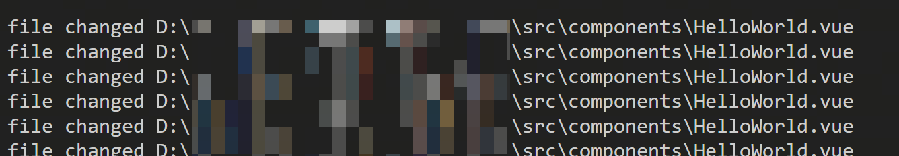
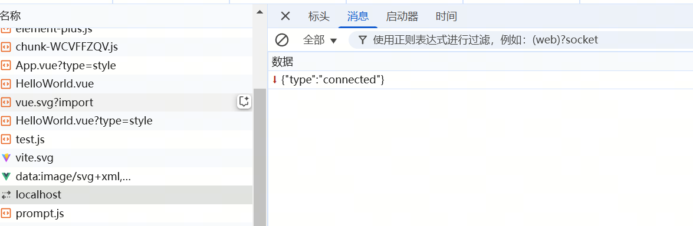
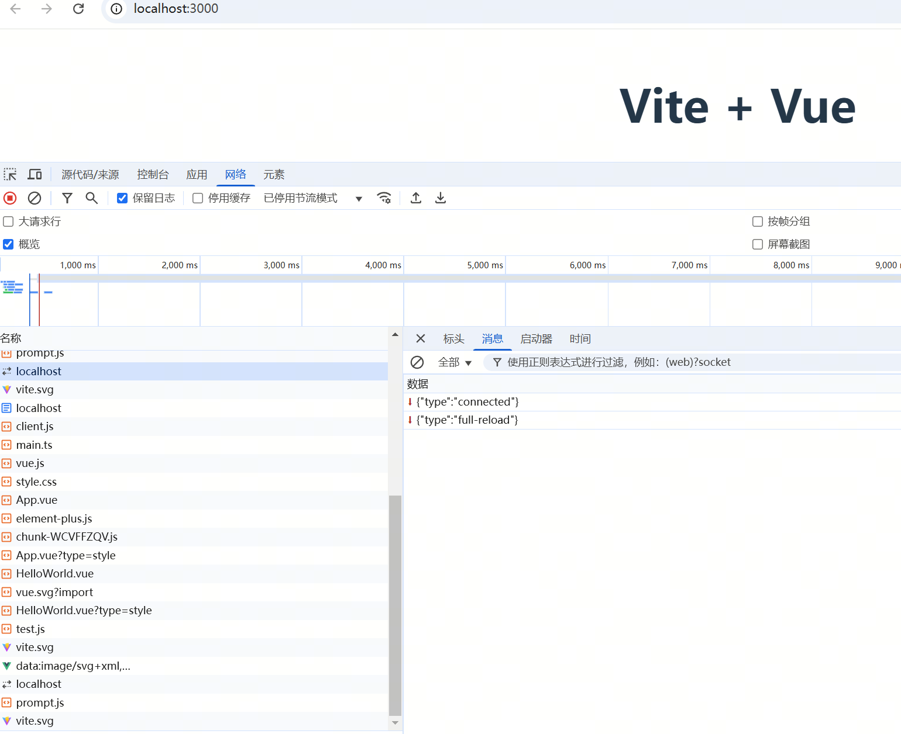
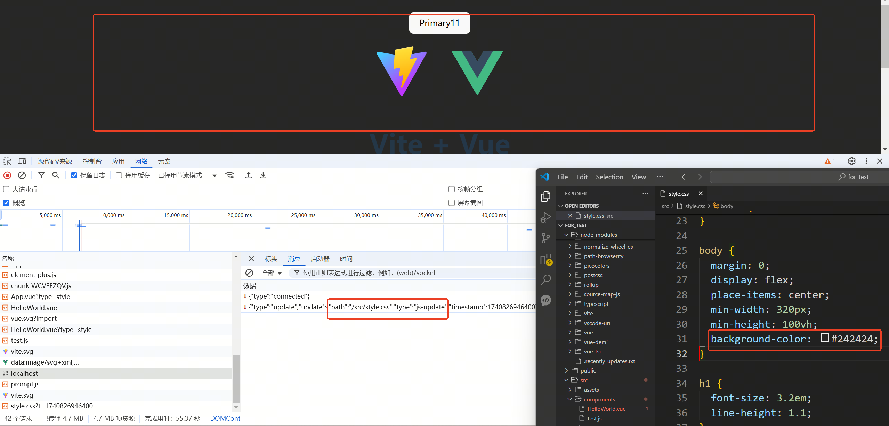
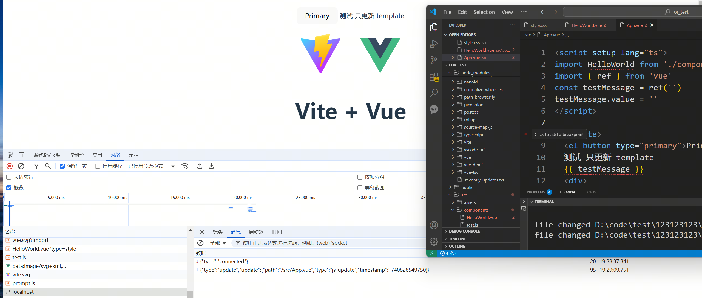
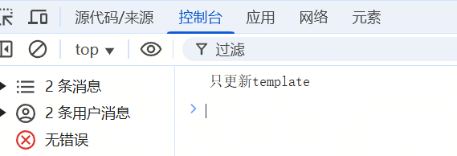
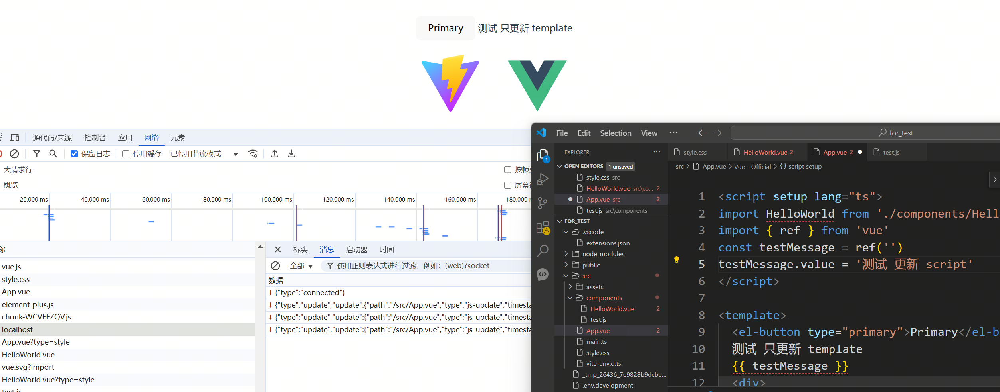
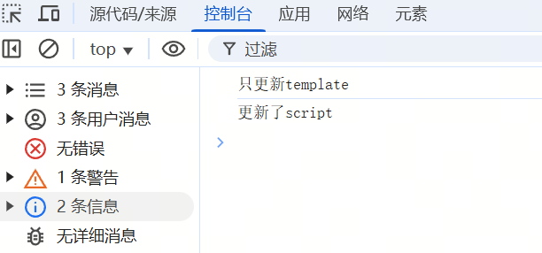

# 重新学习前端工程化：手搓 Vite(三)  

> **有些事，不亲自动手，你永远不会知道它有多简单——或者多难！**  
> 今天，我们不做 Vite 的搬运工，而是尝试亲手造一个迷你版，巩固一下前端工程化的知识。  

### 🎯 本次目标  

1. **HMR（热模块替换）**  
   - 当开发环境中的文件发生变化时，**页面自动更新**，无需手动刷新。  
   - 支持 **CSS、JS、Vue 组件的热更新**，保持开发流畅度。  

---

## ⚙️ HMR 基本原理  

HMR 的核心逻辑主要分为以下几个步骤：  

1️⃣ **监听文件变动** 🔍  
   - 监测开发环境下的文件变化（JS、CSS、Vue 组件等）。  
   
2️⃣ **通知浏览器** 📢  
   - 通过 WebSocket 向客户端发送变更通知。  

3️⃣ **处理文件变化** 🔄  
   - **支持热更新的文件**：增量更新（如 CSS、部分 Vue 组件）。  
   - **不支持热更新的文件**：触发页面整体刷新。  

---

## 👀 监听文件变动  

这里我们使用 `chokidar` 监听文件变更，创建一个 `hmr.js` 文件：  

``` javascript
// hmr.js

import path from 'node:path'
import chokidar from 'chokidar'

function createHmr(root) {
  chokidar
    .watch(path.join(root), { ignoreInitial: true })
    .on('change', (file, status) => {
      // 这里先测试
      console.log('file changed', file)
    })
}

export { createHmr }
``` 

在 `index.js` 中，我们需要集成刚才的 HMR 监听功能，让服务器在启动时就开始监控文件变更，并通过 WebSocket 通知前端。  

我们在 `index.js` 里添加以下代码：  

``` javascript
// index.js

} else if (mode === 'dev' || mode === 'serve') {
  const { createHmr } = await import('./hmr.js')
  createHmr(root)
} else {

``` 

测试了一下，效果不错！  
  
异常简单 (●ˇ∀ˇ●)  

## 通知浏览器文件变化

经常刷八股文的兄弟们肯定清楚，后端主动推送消息给前端的常见方法无非就两个：**WebSocket** 和 **SSE（Server-Sent Events）**。  

这次，我们选择 **WebSocket** 来实现文件更新通知，让前端可以实时感知到文件的变化。  

在 `hmr.js` 中，我们进行如下修改：

``` javascript
// hmr.js

import { WebSocketServer } from 'ws'
import { analysisJsFromVue, analysisCssFromVue } from './plugins/vue.js'
import fs from 'node:fs'

// 在已有的http服务上创建一个 websocket 服务
const createWebSockerServer = (root, server) => {
  const wss = new WebSocketServer({
    server,
  })
  wss.on('connection', (ws) => {
    ws.send(JSON.stringify({ type: 'connected' }))
  })
  createHmr(root, wss)
}

// 文件变化的回调函数
function onfileChange(file, wss) {
  const wsContent = { type: 'update' }

  wss.clients.forEach((client) => {
    if (client.readyState === 1) {
      client.send(
        JSON.stringify(wsContent)
      )
    }
  })
}

// 监测文件变化
function createHmr(root, wss) {
  chokidar
    .watch(path.join(root), { ignoreInitial: true })
    .on('change', (file, status) => {
      console.log('file changed', file)
      onfileChange(file, wss)
    })
}

export { createWebSockerServer }
``` 

接下来，我们需要调整一下代码结构，让 HMR 逻辑更合理地融入整个开发服务器。  

首先，**删除** `index.js` 中启动文件监听的代码，因为 HMR 逻辑更适合放在 `devServer.js` 里统一管理。  

然后，在 `devServer.js` 中，引入 `hmr.js` 并启动文件监听，让 HMR 直接在开发服务器启动时生效：

``` javascript
// devServer.js

import { createWebSockerServer } from './hmr.js'

const createServer = (root, config) => {

  server.listen(port, hostName, () => {
    console.log(`start dev server:   http://${hostName}:${port}/`)
    createWebSockerServer(root, server)
  })
}

```

不过，目前我们只是启动了 **WebSocket 服务器**，但浏览器端并没有对应的 **WebSocket 客户端**，这样前端是无法收到文件变更通知的。  

既然我们之前已经注入了 `client.js`，那就正好可以在里面添加 WebSocket 逻辑，让它来监听 HMR 事件！  

我们修改 `client.js`，增加 WebSocket 连接：

``` javascript
// client.js
const host = new URL(import.meta.url).host
let ws = new WebSocket(`ws://${host}`)
ws.addEventListener('message', ({ data }) => {
  console.log(data)
})

```

测试了一下，**一切顺利！** 🎉  
  

很顺利 (*^_^*)  

## 前端自动刷新

下一步，我们要让浏览器在文件变更后 **自动刷新**，省去手动 F5 的麻烦。  

具体流程如下：  
1. **服务器监听文件变更**，通过 WebSocket 通知前端。  
2. **前端接收到通知后，判断是否需要刷新页面**。  

我们来完善 `hmr.js` 和 `client.js`

``` javascript
// hmr.js

// 文件变化的回调函数
function onfileChange(file, wss) {
  // 这里应该判断文件得类型，比如
  // tsconfig.json 需要重启服务
  // vite.config.ts 需要重启服务
  // 。。。

  let wsContent = {
    type: 'full-reload', update: {
      path: hotModules.get(file),
      type: 'js-update',
      timestamp: Date.now()
    }
  }
  wss.clients.forEach((client) => {
    if (client.readyState === 1) {
      client.send(
        JSON.stringify(wsContent)
      )
    }
  })
}

``` 
``` javascript
// client.js

// 热更新的客户端
class HMRClient {
  constructor() {
    this.initWebSocket()
  }

  initWebSocket() {
    const host = new URL(import.meta.url).host
    let ws = new WebSocket(`ws://${host}`)
    // ws.addEventListener('open', () => {}, { once: true })
    ws.addEventListener('message', async ({ data }) => {
      await this.handleMessage(JSON.parse(data))
    })
  }

  async handleMessage(data) {
    switch (data.type) {
      case 'full-reload':
        window.location.reload()
        break
    }
  }

}

const hmrClient = new HMRClient()

``` 

**测试 HMR 效果！**  
打开页面，修改文件，**暗中观察...** 🤨  

  

目前为止一切顺利。。

---

## 收集支持 HMR 的文件  

接下来，我们需要思考 **哪些文件可以支持热更新，哪些不行？**  

### ❌ 不支持 HMR 的文件  

1. **配置文件（如 `tsconfig.json`、`vite.config.js`）**  
   - 这些文件改动后，可能影响项目的整体编译逻辑，需要完整重启服务才能生效。  
   - 例如，修改 `vite.config.js` 的 `host` 或 `port`，可能会导致 HTTP 服务器需要重启。  

2. **HTML 文件**  
   - 由于 HTML 是页面的入口文件，改动后通常需要整体刷新，而不是部分更新。  

### ✅ 支持 HMR 的文件  

1. **CSS 文件**  
   - 之前我们已经将 CSS 文件转换为字符串，并动态插入 `<style>` 标签。  
   - 这样，我们只需要找到对应的 `<style>` 标签，将其内容替换为最新的 CSS 代码，就能实现热更新！  

2. **Vue 组件（`.vue` 文件）**  
   - Vue 通过 **`render` 函数** 渲染 DOM，因此理论上，我们只需要 **重新执行 `render` 函数** 即可更新页面。  
   - 但如果修改的不仅是 `template`，还涉及 `script` 逻辑，就需要更复杂的处理。例如：

``` javascript
const test = ref(0) => ref(1)
test.value = 2
``` 
这种情况，在我们修改代码时，test的值，已经被修改了。这时，我们不能将test的值重置为代码修改后的版本 1。而是保持test现有的值2.之后再执行rander函数
型号，vue官方都有现成的插件供我们使用。。。

最后我们需要考虑下 普通的 js、ts 文件。
支持hmr。很重要一个条件，是需要文件支持 幂等。但是由于普通的js、ts 文件功能各异。一般的脚手架，都不支持对普通js、ts 文件的热更新


这里我们 新增了一个map，当前端请求一个新的资源时，如果它支持hmr（.css或.vue）。我们把他缓存在这个map中
当这些文件变化时，不要通知前端reload，而是通知浏览器update
在 Vue 组件中，如果修改了 `script` 逻辑，例如定义了一个响应式变量 `test`，初始值为 `1`，但运行时手动修改成 `2`，然后再去编辑 `.vue` 文件，默认情况下 `test` 会被重新初始化，值变回 `1`。  

但在 HMR 机制中，我们希望 **组件的状态不丢失**，即 `test` 仍然保持 `2`，同时 UI 也能更新。这意味着，我们不能简单地销毁并重新创建组件，而是应该 **让 Vue 重新执行 `render` 函数**，但保留组件的响应式状态。  

**幸运的是，Vue 官方已经有现成的 HMR 解决方案**，可以借助 Vue 提供的 API 实现无感知更新。  

---

### 普通 JS / TS 文件的 HMR  

普通的 JavaScript 和 TypeScript 代码能否支持 HMR？  

答案是：**一般不会默认支持**。  

HMR 依赖代码的**幂等性**，即相同的输入必须产生相同的输出。但 JS/TS 文件的功能千差万别，直接替换代码可能会导致意外行为。例如，如果代码中有 `setInterval` 之类的逻辑，而热更新时不清理这些定时器，就可能会导致多个计时器同时运行，造成状态混乱。  

因此，常见的前端工具链 **不会默认支持 JS/TS 文件的 HMR**

---

为了优化性能，我们新增了一个 `map`，用于缓存已经加载过的 HMR 资源（如 `.css` 或 `.vue` 文件）。  

**接下来，我们就来实现 Vue 组件和 CSS 文件的热更新机制！ **  

``` javascript
// hmr.js
const hotModules = new Map()


function createHmr(root, wss) {
  chokidar
    .watch(path.join(root), { ignoreInitial: true })
    .on('change', (file, status) => {
      console.log('file changed', file)
      if (hotModules.has(file)) {
        onfileChange(file, wss)
      } else {
        // 不支持 HMR 的话，直接刷新就好
        wss.clients.forEach((client) => {
          if (client.readyState === 1) {
            client.send(JSON.stringify({ type: 'full-reload' }))
          }
        })
      }
    })
}

export { createWebSockerServer, hotModules }
``` 

在浏览器请求资源的时候，把这些请求收集起来

``` javascript
// devServer.js
import { createWebSockerServer, hotModules } from './hmr.js'

async function modifyResponse(ctx) {

  } else if (uri.endsWith('.css')) {
    await modifyCss(ctx)
    hotModules.set(path.join(ROOT, ctx.request.url), ctx.request.url)
  } else if (uri.endsWith('.vue') && !ctx.request.url.includes('?type=style')) {
    await m
    在 Vite 这样的现代前端构建工具中，模块管理主odifyVueToJs(ctx, ctx.request.url)
    hotModules.set(path.join(ROOT, ctx.request.url), ctx.request.url)
  } else if (uri.endsWith('.vue') && ctx.request.url.includes('?type=style')) {
    await modifyVueToCss(ctx, ctx.request.url)
    hotModules.set(path.join(ROOT, ctx.request.url), ctx.request.url)
  } else if (uri.endsWith('.svg')) {

}
``` 

## 浏览器更新资源

由于 CSS 文件也被转换成了 JS 代码，这时问题就转化为：如何让浏览器加载并更新这些 JS 资源。关键在于，这些资源必须以引用的方式导入，从而能够在需要更新时被动态替换。

回顾前端依赖管理的常用方案，我们不难想到 CommonJS 支持引用更新的特点，而 Vite 则采用 ESM 来管理包。借鉴 CommonJS 的思路，我们设计了以下流程：

1. **维护 hmrContent 类**  
   对于每一个资源，都创建一个 hmrContent 对象，封装该资源相关的 HMR 逻辑和更新回调。

2. **在 hmrClient 中维护一个 Map**  
   这个 Map 用于存储所有资源的 hmrContent 对象，方便后续精准地进行资源更新。

3. **封装 HMR 逻辑为回调函数**  
   将具体的 HMR 处理逻辑抽象成回调，并由 hmrContent 对象负责收集和管理这些回调。

4. **动态导入更新资源**  
   当 hmrClient 接收到 WebSocket 消息，表明某个资源需要更新时，通过 `await import(...)` 的方式请求新的资源版本。

5. **触发资源更新回调**  
   资源更新后，调用对应 hmrContent 对象中收集的回调函数，完成局部更新，而不是整页刷新。


通过这种方式，我们在 client.js 中实现了对资源更新的精细控制，让浏览器能够智能地更新特定模块，极大地提升了开发体验。

``` javascript
// client.js
// 对单独的文件进行热更新的处理
class HMRContext {
  constructor(hmrClient, ownerPath) {
    this.hmrClient = hmrClient
    this.ownerPath = ownerPath

    const mod = hmrClient.hotModulesMap.get(ownerPath)
    if (mod) {
      // 如果存在，说明已经注册过来，需要重置 callbacks
      mod.callbacks = []
    }
  }

  accept(deps) {
    // 收集依赖
    if (typeof deps === "function" || !deps) {
      const mod = this.hmrClient.hotModulesMap.get(this.ownerPath) || {
        id: this.ownerPath,
        callbacks: []
      }
      mod.callbacks.push({
        deps: [this.ownerPath],
        fn: ([mod]) => deps?.(mod)
      })
      this.hmrClient.hotModulesMap.set(this.ownerPath, mod)
    }
  }
}

// 热更新的客户端，用于处理热更新的消息，并回调对应 HMRContext 的处理函数
class HMRClient {
  constructor() {
    // 用于存储所有的 HMRContext
    this.hotModulesMap = new Map()

    this.initWebSocket()
  }

  initWebSocket() {
    const host = new URL(import.meta.url).host
    let ws = new WebSocket(`ws://${host}`)
    // ws.addEventListener('open', () => {}, { once: true })
    ws.addEventListener('message', async ({ data }) => {
      await this.handleMessage(JSON.parse(data))
    })
  }

  async handleMessage(data) {
    switch (data.type) {
      case 'update':
        if (data.update.type === "js-update") {
          const mod = this.hotModulesMap.get(data.update.path)
          if (!mod) {
              // 说明没有注册过，直接返回
              return
          }
          const fetchedNewModule = await this.importUpdatedModule(data.update)
          mod.callbacks.filter( ({deps}) => {
            return deps.includes(data.update.path)
          }).forEach(({ fn }) => {
            fn([fetchedNewModule])
          })
        } else {
          // 资源文件，直接刷新页面
          // 比如link之类的文件
          // 查找对应的link标签，将href替换
        }

        break
      case 'full-reload':
        window.location.reload()
        break
    }
  }
  
  async importUpdatedModule({ path, timestamp }) {
    const importPromise = import(`${path}?t=${timestamp}`)
    importPromise.catch(() => {
      window.location.reload()
    })
    return await importPromise
  }
}

const hmrClient = new HMRClient()

function createHotContext(ownerPath) {
  return new HMRContext(hmrClient, ownerPath)
}
``` 

当浏览器成功请求到一个新的资源后，我们需要做两件事：

1. **调用 `createHotContext`**  
   这个方法用于为新资源创建一个 HMR 上下文，确保它能够正确注册自身的 HMR 逻辑，并加入全局 HMR 管理。

2. **执行 `accept`**  
   `accept` 负责触发相应的回调逻辑，让更新生效。比如：


## css文件处理


对于 CSS 文件的 HMR，我们的目标是 **找到已有的 `<style>` 标签，并更新其内容**，而不是重新加载整个页面。

### 方案：
1. **为每个 CSS 资源创建唯一的 ID**  
   - 这样可以确保多个 CSS 资源不会相互覆盖或混淆。
  
2. **查找对应的 `<style>` 标签**  
   - 如果已经存在，则只更新其内容，而不是新建 `<style>` 标签，避免重复创建无用的 DOM 结构。

3. **动态替换 CSS**  
   - 通过 JavaScript 更新 `<style>` 标签的 `innerHTML`，让页面样式即时生效。

``` javascript
// client.js

// 把所有得样式标签存储，方便后续更新
const sheetsMap = new Map();

function updateStyle(id, content) {
  let style = sheetsMap.get(id);
  if (!style) {
    const style = document.createElement('style')
    style.setAttribute('type', 'text/css')
    style.setAttribute("myvite-id", id);
    style.textContent = content
    document.head.append(style)
  } 
  sheetsMap.set(id, style);
}

```

为了让 CSS 资源支持 HMR，我们需要在服务器端的中间件中做一些调整

``` javascript
// devServer.js
async function modifyCss(ctx) {
  ctx.set('Content-Type', 'text/javascript')
  const content = await getContent(ctx.body)
  const fileName = ctx.request.url.split('/').pop().split('?')[0]
  const code = [
    `import { createHotContext } from "${CLIENT_PATH}";`,
    `const hotContext = createHotContext("${fileName}style");`,
    `import { updateStyle } from "${CLIENT_PATH}"`,
    `let css = ${JSON.stringify(content)}`,
    `updateStyle("${fileName}style", css)`,
    `hotContext.accept()`,
    ].join('\n')

  ctx.body = code
}
``` 

测试结果非常理想！🎉



当我们修改 CSS 并保存后，可以看到以下几个关键步骤：
1. **WebSocket 收到更新通知**  
   - 服务器检测到 CSS 文件变更，主动通过 WebSocket 发送更新消息给前端。

2. **前端重新请求 CSS 资源**  
   - 浏览器的 HMR 逻辑捕获到更新，使用 `import()` 方式重新获取最新的 CSS 文件。

3. **页面样式自动更新**  
   - `updateStyle` 函数找到原来的 `<style>` 标签，并替换其内容，使新样式立即生效，而不需要刷新页面。

## vue文件处理

在 Vue 的 HMR 机制中，官方提供了 `__VUE_HMR_RUNTIME__` 对象，它包含了几个关键方法：
- **`createRecord`**：用于在 HMR 记录表中创建组件的 HMR 记录。
- **`rerender`**：仅更新组件的 `template`，不会重新执行 `script`，适用于模板内容变更的情况。
- **`reload`**：完全重新加载组件，包括 `script` 逻辑，适用于修改了 `script` 代码的情况。

在 Vite 中，通常是通过 `@vite/plugin-vue` 来解析 `.vue` 文件，并根据文件的变化类型，自动决定是调用 `rerender` 还是 `reload`，或者只是更新 `style`。

但是，我们不依赖 Vite 的插件，而是自己实现这一逻辑：
1. **存储 Vue 组件的 Hash**  
   - 维护一个 `Map` 记录 `.vue` 文件编译后的 Hash 值，避免无效的 HMR 触发（比如仅增加一个空格）。

2. **判断更新策略**
   - 监听 `.vue` 文件的变更，重新计算编译后的 Hash。
   - 如果 `template` 发生变化，则调用 `rerender`。
   - 如果 `script` 发生变化，则调用 `reload`。
   - 如果仅 `style` 变化，则更新样式，不触发 `rerender` 或 `reload`。

我们新建 `plugins/vue.js` 来实现这一逻辑，并在 `hmr.js` 中集成这一插件。🚀

``` javascript
// plugins/vue.js

// 判断vue文件是否发生变化得缓存
const vueHashMap = new Map();

function analysisJsFromVue(content, filename) {
  // 省略解析 script 和 template 的代码
  // 省略对 script 和 template 做hash的代码
  // 省略通过 vueHashMap 判断 script 和 template 是否更新的代码 
  return {
    vueScriptCodeJs,
    vueTemplateCode,
    hasStyle,
    hasChangeScript,
    hasChangeTemplate,
    scriptHash,
    templateHash
  }
}

function analysisCssFromVue(content, filename) {
  // 省略解析 style 的代码
  // 省略对 style 做hash的代码
  // 省略通过 vueHashMap 判断 style 是否更新的代码 

  return { cssContent, hasChangeCss }
}

function extractJsFromVue(content, url) {
  const fileName = url.split('/').pop().split('?')[0]
  const uriName = url.split('?')[0]

  const {
    vueScriptCodeJs,
    vueTemplateCode,
    hasStyle,
    hasChangeScript,
    scriptHash
  } = analysisJsFromVue(content, fileName)

  let code = []

  if (hasStyle) {
    code.push(`import "${uriName}?type=style"`)
  }

  code = [
    `import { createHotContext } from "${CLIENT_PATH}";`,
    `const hotContext = createHotContext("${uriName}");`,
    ...code,
    vueScriptCodeJs.replace(
      'export default',
      `const main =`
    ),
    vueTemplateCode,
    `main.render = render`,
    `export const _rerender_only = ${hasChangeScript ? 'false' : 'true'}`,
    `main.__hmrId = "${scriptHash}";
typeof __VUE_HMR_RUNTIME__ !== "undefined" && __VUE_HMR_RUNTIME__.createRecord(main.__hmrId, main);
hotContext.accept((mod) => {
  if (!mod) return;
  const { default: updated, _rerender_only } = mod;
  if (_rerender_only) {
    console.log('只更新template')
    __VUE_HMR_RUNTIME__.rerender(updated.__hmrId, updated.render);
  } else {
    console.log('更新了script')
    __VUE_HMR_RUNTIME__.reload(updated.__hmrId, updated);
  }
});`,
    `export default main`,
  ].join('\n')

  return { code }
}

function extractCssFromVue(content, url) {
  const fileName = url.split('/').pop()

  const { cssContent } = analysisCssFromVue(content, fileName)

  const code = [
    `import { createHotContext } from "${CLIENT_PATH}";`,
    `const hotContext = createHotContext("${url}");`,
    `import { updateStyle } from "${CLIENT_PATH}"`,
    `let css = ${JSON.stringify(cssContent)}`,
    `updateStyle("${url}", css)`,
    `hotContext.accept()`,
  ].join('\n')

  return { code }
}

export { extractJsFromVue, extractCssFromVue, analysisJsFromVue, analysisCssFromVue }
``` 

别忘了修改devServer中对应的中间件

``` javascript
// devServer.js
async function modifyVueToJs(ctx, url) {
  ctx.set('Content-Type', 'text/javascript')
  const content = await getContent(ctx.body)
  const { code } = extractJsFromVue(content, url)
  ctx.body = modifyImport(code)
}

async function modifyVueToCss(ctx, url) {
  ctx.set('Content-Type', 'text/javascript')
  const content = await getContent(ctx.body)
  const { code } = extractCssFromVue(content, url)
  ctx.body = code
}
``` 

在 `hmr.js` 中，我们需要完善逻辑

``` javascript
// hmr.js
// 文件变化的回调函数
function onfileChange(file, wss) {
  let wsContent = { type: 'full-reload' }
  // 这里应该判断文件得类型，比如
  // tsconfig.json 需要重启服务
  // vite.config.ts 需要重启服务
  // 普通js 或者 ts 文件可能需要重新加载页面
  // 。。。

  // 这里只处理 vue 文件
  if (file.endsWith('vue')) {
    const fileContent = fs.readFileSync(file, 'utf-8')
    
    const { hasChangeScript, hasChangeTemplate } = analysisJsFromVue(fileContent, file)
    const { hasChangeCss } = analysisCssFromVue(fileContent, file)
    if (hasChangeScript || hasChangeTemplate) {
      wsContent = {
        type: 'update', update: {
          path: hotModules.get(file),
          type: 'js-update',
          timestamp: Date.now()
        }
      }
    } else if (hasChangeCss) {
      wsContent = {
        type: 'update', update: {
          path: hotModules.get(file) +"?type=style",
          type: 'js-update',
          timestamp: Date.now()
        }
      }
    } else {
      // 代码得编译结果没有实际更新 不需要更新
      return
    }
  } else if (file.endsWith('css')) {
    wsContent = {
      type: 'update', update: {
        path: hotModules.get(file),
        type: 'js-update',
        timestamp: Date.now()
      }
    }
  }
  wss.clients.forEach((client) => {
    if (client.readyState === 1) {
      client.send(
        JSON.stringify(wsContent)
      )
    }
  })
}
``` 

### 最终测试与验证  

我们准备了以下的测试代码

### ✅ **1. 修改 `<template>`**
- **改动**：在 `HelloWorld.vue` 的 `<template>` 中添加一段文本。
- **预期结果**：组件重新渲染，新内容正确显示，且页面不会整体刷新。
- **实际结果**：
  - WebSocket 接收到更新通知。
  - 页面无感刷新，新的文本成功显示。
  
  **截图：**



### ✅ **2. 修改 `<script>`**
- **改动**：在 `HelloWorld.vue` 的 `<script>` 修改了 `testMessage`的值。
- **预期结果**：组件重新加载，但不触发页面刷新，新的逻辑生效。
- **实际结果**：
  - WebSocket 接收到更新通知。
  - 但前端未自动渲染最新的 script 逻辑，需进一步排查。
  
  **截图：**

我们可以看到 ，在script中添加一段话后，websocket收到了一个消息
但是前端并没有将我们修改的内容渲染在页面上



至此，hmr的开发就全部完成了


未完待续~ 😆🚀  

