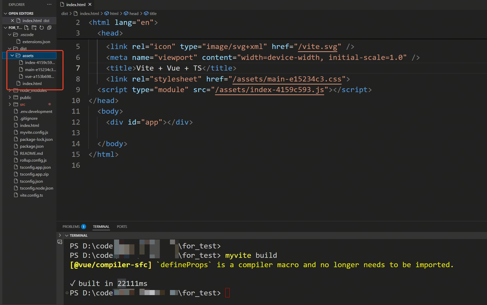
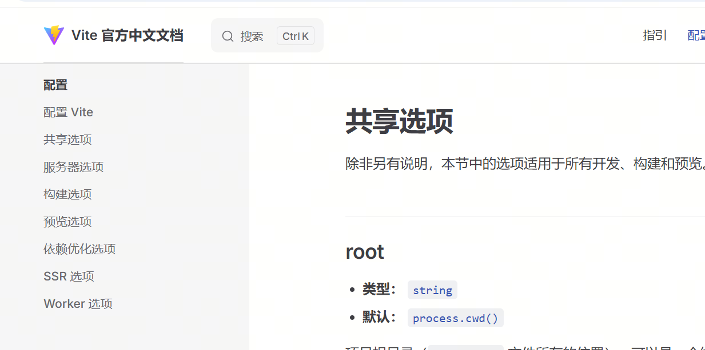

# 重新学习前端工程化：手搓 Vite(三)  

> **有些事，不亲自动手，你永远不会知道它有多简单——或者多难！**  
> 今天，我们不做 Vite 的搬运工，而是尝试亲手造一个迷你版，巩固一下前端工程化的知识。  

## 🎯 本次目标

- **实现 `myvite build` 命令**，用于构建 Vue + TypeScript 项目。
- **使用 Rollup 进行打包**，确保最终生成的产物可在浏览器中正常运行。
- **打包后的文件可直接放入 Web 服务器**，并能正确加载和执行。

---

## ⚙️ **Rollup 的基础配置**

Vite 在生产环境下，默认是使用 **Rollup** 进行项目打包的。因此，我们也将基于 Rollup 来编写一个简化版的构建脚本。

``` javascript
// build.js

import path from 'node:path'
import fs from 'node:fs'
import { rollup } from 'rollup'
import terser from '@rollup/plugin-terser'
import html from '@rollup/plugin-html'
import commonjs from '@rollup/plugin-commonjs'
import styles from 'rollup-plugin-styles'
import url from '@rollup/plugin-url'
import vue from 'rollup-plugin-vue'
import resolve from '@rollup/plugin-node-resolve';
import replace from '@rollup/plugin-replace'
import alias from '@rollup/plugin-alias'
import esbuild from 'rollup-plugin-esbuild'
import { fileURLToPath, URL } from 'node:url'

const BUILD_HTMLTITLE = 'my App'

function clearDir(dir) {
  if (fs.existsSync(dir)) {
    fs.rmSync(dir, { recursive: true })
  }
}

function findInputInRoot(root) {
  const rootPath = path.join(root, 'src')

  for (const file of fs.readdirSync(rootPath)) {
    if (file.startsWith('main')) {
      return `/src/${file}`
    }
  }

  throw new Error('No entry file found in src directory')
}


async function createBuild(root, config) {
  const { outDir, assetsDir='assets' } = config
  const template = path.join(root, 'index.html')
  const dir = path.join(root, outDir || 'dist')
  const main = findInputInRoot(root)
  const input = path.join(root, main)

  const inputOptions = {
    input,
    plugins: [
      // 可以代码中使用 @ 别名
      alias({
        '@': fileURLToPath(new URL('./src', import.meta.url))
      }),
      // 解析 .vue 文件为 sfc
      vue(),
      // 处理css
      styles({
        mode: 'extract',
        minimize: true,
      }),
      // esbuild，这里用来编译 TypeScript
      esbuild({ target: 'esnext', loader: 'ts' }), // 使用 esbuild 编译 TypeScript
      // rollup 能够识别和处理 npm 包
      resolve(),
      // 将代码中的 process.env.NODE_ENV 替换为 production
      replace({
        preventAssignment: true,
        'process.env.NODE_ENV': JSON.stringify('production'),
      }),
      // rollup 能够识别 commonjs 模块
      commonjs(),
      // 处理图片
      url({
        include: ['**/*.svg', '**/*.png', '**/*.jpg', '**/*.gif'],
        limit: 0,
        fileName: `./${assetsDir}/[name]-[hash][extname]`,
      }),
      // 处理 html 文件。这里为了 html 文件中引入编译新生成的 css 和 js 文件。并删除对开发环境的 css 和 js 的引入
      html({
        title: BUILD_HTMLTITLE,
        template: async ({ files }) => {
          // files 是一个对象，包含了 entrypoints 生成的所有文件
          // 我们需要把他们按顺序引入到 html 模板中

          let code = fs.readFileSync(template).toString()
          code = code.replace(`<script type="module" src="${main}"></script>`, '')

          let fileTags = []
          if (files.css) {
            const cssTags = files.css.map((item) => {
              return '\t' + `<link rel="stylesheet" href="/${item.fileName}">`
            })
            fileTags = [...fileTags, ...cssTags]
          }
          if (files.js) {
            const jsTags = files.js.map((item) => {
              return (
                '\t' + `<script type="module" src="/${item.fileName}"></script>`
              )
            })
            fileTags = [...fileTags, ...jsTags]
          }
          if (fileTags.length) {
            code = code.replace('</head>', fileTags.join('\n') + '\n</head>')
          }
          return code
        },
      }),
      // 压缩 js 文件
      terser()
    ],
  }
  const outputOptions = {
    dir,
    format: 'es',
    entryFileNames: `${assetsDir}/index-[hash].js`,
    assetFileNames: `${assetsDir}/[name]-[hash].[ext]`,
    chunkFileNames: `${assetsDir}/[name]-[hash].js`,
  }
  clearDir(dir)
  const start = Date.now()
  const bundle = await rollup(inputOptions)
  await bundle.write(outputOptions)
  await bundle.close()
  const end = Date.now()
  console.log(`✓ built in ${Math.round(end - start)}ms`)
}

export { createBuild }
```

在 `index.js` 中配置 `build` 命令

``` javascript
// index.js

if (mode === 'build') {
  const { createBuild } = await import('./build.js')
  createBuild(root, config)
} else if (mode === 'dev' || mode === 'serve') {

```

打包测试结果如下：



从截图可以看出，Rollup 已经成功执行了打包操作，并输出了对应的构建产物。  

不过，目前这只是最基础的默认配置，还没有应用配置文件，接下来我们需要继续实现这个逻辑

## 📌 **使用 Vite 的配置**

在继续优化 Rollup 构建之前，我们先研究一下 Vite 默认的构建配置。  
以下是一个 Vite 处理 Vue3 + TypeScript 项目的基础配置示例：

``` javascript
// vite.config.ts

import { defineConfig } from 'vite'
import vue from '@vitejs/plugin-vue'
import vueJsx from '@vitejs/plugin-vue-jsx'
import { fileURLToPath, URL } from 'node:url'

export default defineConfig((config) => {
  return {
    build: {
      rollupOptions: {
        input: {
          normal: 'index.html'
        },
        // 静态资源分类打包
        output: {
          chunkFileNames: 'static/js/[name]-[hash].js',
          entryFileNames: 'static/js/[name]-[hash].js',
          assetFileNames: 'static/[ext]/[name]-[hash].[ext]'
        }
      }
    },
    plugins: [vue(), vueJsx(), terser()],
    resolve: {
      alias: {
        '@': fileURLToPath(new URL('./src', import.meta.url))
      }
    }
  }
})
```

在正式开发前，我们先通过官方文档分析 Vite 配置的作用。

)


对于本次构建，我们主要关注 **共享选项** 和 **构建选项**

结合 Vite 与 Rollup 官方文档，我们整理了一些关键的基础配置：


### 🌍 **共享选项（Common Options）**
这些选项适用于 **开发环境和生产环境**，主要影响项目的结构和模块解析方式。

- **`root`**：指定项目的根目录，通常是 `index.html` 文件所在的位置。
- **`plugins`**：定义 Vite 插件列表，可用于扩展功能（如 Vue 解析、TypeScript 支持）。
- **`resolve.alias`**：设置路径别名（例如 Vue 项目中常见的 `@` 代表 `src` 目录）。

---

### 📦 **构建选项（Build Options）**
这些选项主要影响 **生产环境** 下的打包方式。

- **`build.outDir`**：指定构建输出目录，通常默认为 `dist`。
- **`build.assetsDir`**：设置静态资源存放目录（相对于 `build.outDir`）。
- **`build.rollupOptions`**：自定义底层的 Rollup 配置，包括：
  - **`input`**：指定 Rollup 入口文件（通常是 `index.html`）。
  - **`output.chunkFileNames`**：用于代码分割时，动态生成的 chunk 文件的命名规则。
  - **`output.entryFileNames`**：指定入口文件的输出命名规则。
  - **`output.assetFileNames`**：定义静态资源（CSS、图片等）的文件命名方式。
  - **`plugins`**：用于自定义 Rollup 插件列表，以扩展构建能力。

---

在 Vite 配置中，部分 **共享选项（Common Options）** 直接影响 **构建选项（Build Options）**。因此，在构建时，我们需要将某些共享选项映射到 `build.rollupOptions` 中

### 📌 **关键配置映射**
1. **`root`** 影响 **`build.rollupOptions.input`**  
   - `root` 作为项目根目录，会影响 Rollup 查找入口文件的 **相对路径**。

2. **`plugins`** 影响 **`build.rollupOptions.plugins`**  
   - `plugins` 主要用于 Vite 开发环境，但在构建时，也可能需要 **替换** 或 **拆分** 部分插件。

3. **`resolve.alias`** 影响 **Rollup 的 alias 配置**  
   - Vite 的 `resolve.alias` 需要映射到 Rollup 的 `alias` 插件，以确保构建时路径解析一致。

### ✨ **优化思路**
为了简化配置迁移，我们可以编写一个 **转换函数**，将 **共享选项** 复制到 **构建选项** 中，并提供合理的默认值。例如：
- **自动填充 `build.rollupOptions.input`**  
- **合并 `plugins`，以确保 Rollup 正确解析 Vue、TypeScript 等**
- **调整 `resolve.alias`，使 Rollup 也能使用路径别名**

这样，我们就能确保 **开发环境和构建环境的配置尽可能保持一致**，避免额外的手动配置调整。


``` javascript
// devServer.js

```


未完待续~ 😆🚀
